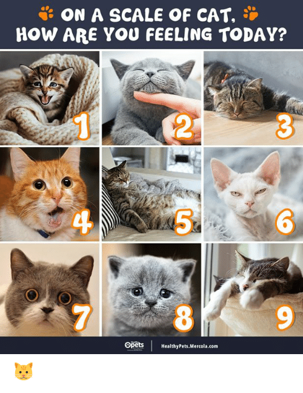
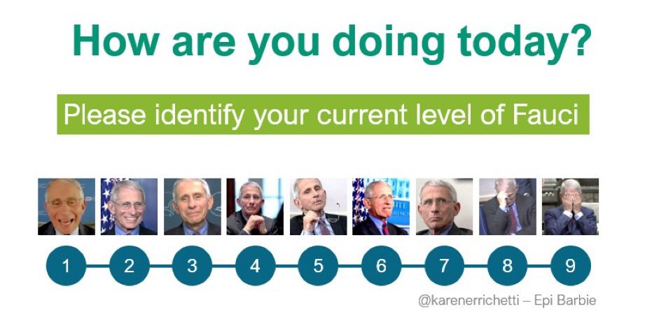

```{r setup, include=FALSE}
# R options
options(
  htmltools.dir.version = FALSE, # for blogdown
  show.signif.stars = FALSE,     # for regression output
  warm = 1
  )
# Set dpi and height for images
library(knitr)
opts_chunk$set(fig.height = 2.65, dpi = 300) 
# ggplot2 color palette with gray
color_palette <- list(gray = "#999999", 
                      salmon = "#E69F00", 
                      lightblue = "#56B4E9", 
                      green = "#009E73", 
                      yellow = "#F0E442", 
                      darkblue = "#0072B2", 
                      red = "#D55E00", 
                      purple = "#CC79A7")

options(htmltools.dir.version = FALSE)
knitr::opts_chunk$set(
	fig.align = "center",
	fig.height = 3.75,
	fig.width = 6.25,
	message = FALSE,
	warning = FALSE
)
```

```{r echo=FALSE, message=FALSE, warning=FALSE}
library(tidyverse)
```


### How are you feeling today?

<br>

.center[
.col-3[

<font class = "large-emoji">
1) `r emo::ji("slightly_smiling_face")` 
</font>


<br>
<br>

<font class = "large-emoji">
4) `r emo::ji("nerd_face")`
</font>
]

.col-3[

<font class = "large-emoji">
2) `r emo::ji("laughing")`
</font>

<br>
<br>

<font class = "large-emoji">
5) `r emo::ji("slightly_frowning_face")`
</font>

]

.col-3[
<font class = "large-emoji">
3) `r emo::ji("sleeping")`
</font>

<br>
<br>

<font class = "large-emoji">
6) `r emo::ji("sunglasses")`
</font>
]
]

---

### If you could have these superpowers, which one would you choose?

<!-- From https://slidelizard.com/en/blog/icebreaker-polls --> 

<br>

.center[
.col-3[

<font class = "large-emoji">
1) `r emo::ji("eyes")` 
</font>

Be invisible anytime


<br>
<br>

<font class = "large-emoji">
4) `r emo::ji("flexed_biceps")`
</font>

Superhuman Strength
]

.col-3[

<font class = "large-emoji">
2) `r emo::ji("dog_face")`
</font>

Talk to animals

<br>
<br>

<font class = "large-emoji">
5) `r emo::ji("brain")`
</font>

Read minds


]

.col-3[
<font class = "large-emoji">
3) `r emo::ji("eagle")`
</font>

Be able to fly

<br>
<br>

]
]

---

<!--https://me.me/i/on-a-scale-of-cat-how-are-you-feeling-today-b4227c3b307742b2bac06579ecc1a253-->

```{r echo = F, out.width = "40%"}

```

---
.col-3[
.midi[**1)** Avatar 2.0]

.midi[**2)** GG Gods]

.midi[**3)** The Office]

.midi[**4)** META]

.midi[**5)** Rash]

.midi[**6)** Dog Lovers]

.midi[**7)** Team Tuition]

.midi[**8)** Blue Devils]

.midi[**9)** Unexciting Places]

.midi[**10)** Whataburger]
]

.col-3[

.midi[**11)** The Water Tribe]

.midi[**12)** ABP Lovers]

.midi[**13)** JJAY]

.midi[**14)** Psychologists]

.midi[**15)** The Outliers]

.midi[**16)** The Unoriginals]

.midi[**17)** I'm Fine with Anything]

.midi[**18)** Piano Plot]

.midi[**19)**  CASA]

.midi[**20)** Rtists]
]


.col-3[
.midi[**21)**Team Six]

.midi[**22)**The Blue Wolves]

.midi[**23)** ZZZ Test]

.midi[**24)** y2k]

.midi[**25)** The A Team]

.midi[**26)** Easy As Pie]

.midi[**27)** Last!]
]


---

```{r echo = F, out.width = "100%"}

```


.small[[Image source](https://twitter.com/karenerrichetti/status/1322597290343804928/photo/1)]