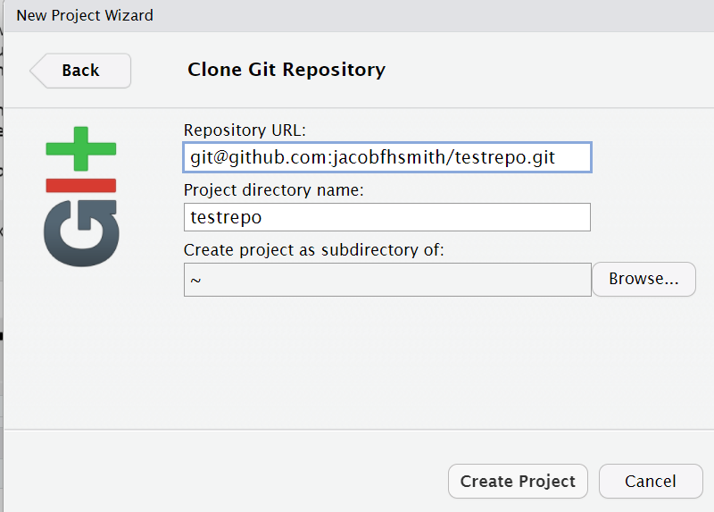
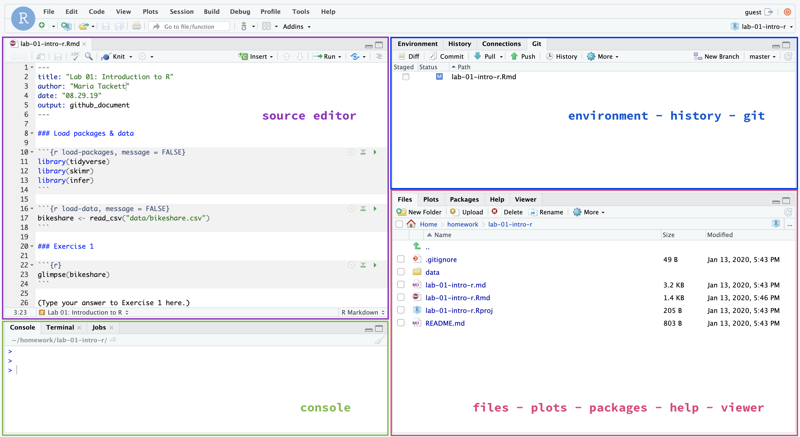

```{r setup, include=FALSE}
knitr::opts_chunk$set(echo = TRUE,
                      warning=FALSE, 
                      message=FALSE)
```


# Introduction

```{marginfigure}
R is the name of the programming language itself and RStudio is a convenient interface.
```

This lab will go through much of the same workflow we've demonstrated in class.
The main goal is to reinforce our demo of R and RStudio, which we will be using throughout the course both to learn the statistical concepts discussed in the course and to analyze real data and come to informed conclusions.

```{marginfigure}
git is a version control system (like “Track Changes” features from Microsoft Word but more powerful) and GitHub is the home for your Git-based projects on the internet (like DropBox but much better).
```

An additional goal is to reinforce git and GitHub, the collaboration and version control system that we will be using throughout the course.

As the labs progress, you are encouraged to explore beyond what the labs dictate; a willingness to experiment will make you a much better programmer.
Before we get to that stage, however, you need to build some basic fluency in R.
Today we begin with the fundamental building blocks of R and RStudio: the interface, reading in data, and basic commands.

To make versioning simpler, this and the next lab are solo labs. In the future, you'll learn about collaborating on GitHub and producing a single lab report for your lab team, but for now, concentrate on getting the basics down.

## Learning goals 

By the end of the lab, you will...

- Be familiar with the workflow using RStudio and GitHub
- Gain practice writing a reproducible report using RMarkdown
- Practice version control using GitHub
- Be able to create data visualizations using `ggplot2`
- Be able to describe variable distributions and the relationship between multiple variables 

# Getting Started 

## Your lab TA will lead you through the Getting Started section.

## Configuring SSH and GitHub

### Set up SSH Key

You will authenticate GitHub using SSH.
Below are an outline of the authentication steps; you are encouraged to follow along as your TA demonstrates the steps.
[Click here](https://github.com/DukeStatSci/github_auth_guide) to find more detailed instructions.

*Note: You only need to do this authentication process one time on a single system.*

-   **Step 1**: Type `credentials::ssh_setup_github()` into your console.
-   **Step 2**: R will ask "No SSH key found. Generate one now?" You should click 1 for yes.
-   **Step 3**: You will generate a key. It will begin with "ssh-rsa...." R will then ask "Would you like to open a browser now?" You should click 1 for yes.
-   **Step 4**: You may be asked to provide your username and password to log into GitHub. This would be the ones associated with your account that you set up. After entering this information, you should paste the key in and give it a name.

## Configure git 

There is one more thing we need to do before getting started on the assignment. Specifically,  we need to configure your git so that RStudio can communicate with GitHub. This requires two pieces of information: your name and email address.

To do so, you will use the `use_git_config()` function from the `usethis` package. 

Type the following lines of code in the **console** in RStudio filling in your name and the email address associated with your GitHub account.


```{r eval=FALSE}
usethis::use_git_config(user.name = "GitHub username", 
               user.email = "your email")
```

For example, mine would be 

```{r eval=FALSE}
usethis::use_git_config(user.name = "matackett",
               user.email = "maria.tackett@duke.edu")
```

You are now ready interact between GitHub and RStudio!


## Clone the repo & start new RStudio project

-   Go to the course organization at  [**github.com/sta210-fa21**](https://github.com/sta210-fa21) organization on GitHub. Click on the repo with the prefix **lab-01**. It contains the starter documents you need to complete the lab.

```{r clone-repo-link, echo = FALSE, fig.width = 5}
```

-   Click on the green **CODE** button, select **Use SSH** (this might already be selected by default, and if it is, you'll see the text **Clone with SSH**). Click on the clipboard icon to copy the repo URL.


```{marginfigure}
If you get an error message that begins with *WARNING: UNPROTECTED PRIVATE KEY FILE!* then this can be fixed by clicking on "Terminal" (the tab next to the console) and pasting in `chmod 400 ~/.ssh/id_rsa` and hitting enter.
Then, try to create a project again and it should work.
```

-   Go to <https://vm-manage.oit.duke.edu/containers> and login with your Duke NetID and Password.

-   Click **STA210** to log into the Docker container.
    You should now see the RStudio environment.

-   Go to *File* $\rightarrow$ *New Project* $\rightarrow$ *Version Control* $\rightarrow$ *Git*.

-   Copy and paste the URL of your assignment repo into the dialog box *Repository URL*. Again, please make sure to have *SSH* highlighted under *Clone* when you copy the address.



-   Click *Create Project*, and the files from your GitHub repo will be displayed in the *Files* pane in RStudio.

-   Click *lab-01-ikea.Rmd* to open the template R Markdown file.
    This is where you will write up your code and narrative for the lab.


## R and R Studio

Below are the components of the RStudio IDE.



Below are the components of an R Markdown (.Rmd) file.


## Warm up

Before we introduce the data, let's warm up with some simple exercises.

We're going to go through our first **knit**, **commit**, and **push**.

## YAML

The top portion of your R Markdown file (between the three dashed lines) is called **YAML**.
It stands for "YAML Ain't Markup Language".
It is a human friendly data serialization standard for all programming languages.
All you need to know is that this area is called the YAML (we will refer to it as such) and that it contains meta information about your document.

Open the R Markdown (.Rmd) file in your project, change the author name to your name, and knit the document.

Examine the knitted document.

## Commiting changes

Now, go to the Git pane in your RStudio instance.
This will be in the top right hand corner in a separate tab.

If you have made changes to your Rmd file, you should see it listed here.
Click on it to select it in this list and then click on **Diff**.
This shows you the *diff*erence between the last committed state of the document and its current state including changes.
You should see deletions in red and additions in green.

If you're happy with these changes, we'll prepare the changes to be pushed to your remote repository.
First, **stage** your changes by checking the appropriate box on the files you want to prepare.
Next, write a meaningful commit message (for instance, "updated author name") in the **Commit message** box.
Finally, click **Commit**.
Note that every commit needs to have a commit message associated with it.

You don't have to commit after every change, as this would get quite tedious.
You should commit states that are *meaningful to you* for inspection, comparison, or restoration.

In the first few assignments we will tell you exactly when to commit and in some cases, what commit message to use.
As the semester progresses we will let you make these decisions.


Now let's make sure all the changes went to GitHub. Go to your GitHub repo and refresh the page. You should see your commit message next to the updated files. If you see this, all your changes are on GitHub and you're good to go! 


## Pushing changes

Now that you have made an update and committed this change, it's time to push these changes to your repo on GitHub.

In order to push your changes to GitHub, you must have **staged** your **commit** to be pushed.
click on **Push**.

To get more details about the RStudio project, RMarkdown file, and just R in general, read [Getting Started](https://socviz.co/gettingstarted.html#gettingstarted) in *Data Visualization* by Kieran Healy.

## Packages

We will use the following package in today's lab. 

```{r load-packages}
library(tidyverse)
```


# Data: Ikea furniture

Today's data is all about [Ikea](https://www.ikea.com/) furniture. The data was obtained from the [TidyTuesday](https://github.com/rfordatascience/tidytuesday/blob/master/data/2020/2020-11-03/readme.md) data collection. 

Use the code below to read in the data.

```{r read-data}
ikea <- read_csv("data/ikea.csv")
```

The variable definitions are as follows: 

|variable          |class     |description |
|:-----------------|:---------|:-----------|
|item_id           |double    | item id which can be used later to merge with other IKEA data frames |
|name              |character | the commercial name of items |
|category          |character | the furniture category that the item belongs to (Sofas, beds, chairs, Trolleys,…) |
|sellable_online   |logical   | Sellable online TRUE or FALSE |
|link              |character | the web link of the item |
|other_colors      |character | if other colors are available for the item, or just one color as displayed in the website (Boolean) |
|short_description |character | a brief description of the item |
|designer          |character | The name of the designer who designed the item. this is extracted from the full_description column. |
|depth             |double    | Depth of the item in Centimeter |
|height            |double    | Height of the item in Centimeter|
|width             |double    | Width of the item in Centimeter|
|price_usd            |double    | the current price in US dollars as it is shown in the website by 4/20/2020|

## View the data 

Before doing any analysis, you may want to get quick view of the data. This is useful when you've imported data to see if your data imported correctly. We can use the `View` function to see the entire data set in RStudio. Type the code below in the **console** to view the entire dataset. 

```{marginfigure}
Notice that the `View(ikea)` command was run in the console and **not** in a code chunk in the RMarkdown file. By running the `View(ikea)` in the console, the dataset displays in your RStudio environment but not in the PDF output from your knitted Rmd file. 
```

```{r eval=FALSE}
View(ikea)
```

# Exercises 

## Instructions 

Write all code and narrative in your R Markdown file. Write all narrative in complete sentences. Throughout the assignment, you should periodically **knit** your R Markdown document to produce the updated PDF, **commit** the changes in the Git pane, and **push** the updated files to GitHub. 

**Tip**: Make sure we can read all or your code in your PDF document. This means you will need to break up long lines of code. One way to help avoid long lines of code is is start a new line after every pipe (`%>%`) and plus sign (`+`). 

1. The `View` function helped us get a quick view of the dataset, but let's get more detail about its structure. Viewing a summary of the data is a useful starting point for data analysis, especially if the dataset has a large number of observations (rows) or variables (columns). Run the code below to use the `glimpse` function to see a summary of the `ikea` dataset.

  How many observations are in the `ikea` dataset? How many variables?


```{r eval = F}
glimpse(ikea)
```

2. We begin each regression analysis with exploratory data analysis (EDA) to help us "get to know" the data and examine the variable distributions and relationships between variables. We do this by visualizing the data and calculating summary statistics to describe the variables in our dataset. In this lab, we will focus on data visualizations. 


  Let's begin by looking at the price of Ikea furniture. Use the code below to visualize the distribution of `price_usd`, the price in US dollars. 

```{r}
ggplot(data = ikea, aes(x = price_usd)) +
  geom_histogram()
```

  - Use the visualization to describe the distribution of price. In your narrative, include description of the shape, approximate center, approximate spread, and any presence of outliers. 

  - Briefly explain why the median is more representative of the center of this distribution than the mean.

3. When we make visualizations, we want them to be clear and suitable for a professional audience. This means that, at a minimum, each visualization should have **an informative title** and **informative axis labels**. Let's modify the plot from the previous question to make it suitable for a professional audience. Complete the code below to include an informative title and informative axis labels. 


```{r eval = F}
ggplot(data = ikea, aes(x = price_usd)) +
  geom_histogram() + 
  labs(x = "_____",
       y = "_____", 
       title = "_____")
```


```{marginfigure}
Check your lab-01 repo on the GitHub website (you may need to refresh the page in your browser) to ensure that all of the files are up-to-date.
```

::: {.commit}
`r emo::ji("yarn")` `r emo::ji("white_check_mark")` `r emo::ji("arrow_up")` This is a good place to knit, commit, and push changes to your remote lab-01 repo on GitHub. Write an informative commit message (e.g. "Completed exercises 1 - 3"), and push every file to GitHub by clicking the checkbox next to each file in the Git pane. After you push the changes, the Git pane in RStudio should be empty.
::: 


```{marginfigure}
See the [ggplot2 reference on density plots](https://ggplot2.tidyverse.org/reference/geom_density.html) for code examples.
```

4. Another way to visualize numeric data is using density plots. Make a density plot to visualize the distribution of `price_usd`. Be sure to include an informative title and informative axis labels. 


In this course, we'll be most interested in the relationship between two or more variables, so let's begin by looking at the distribution of price by category. We'll focus on the five categories in the code below, since these include commonly purchased types of furniture. 

Use the code below to create a new data frame that only includes the furniture categories of interest. We're assigning this data frame to an object with a new name, so we don't overwrite the original data. 

**You will use this new data frame for the remainder of the lab.**

```{r}
ikea_sub <- ikea %>%
  filter(category %in% c("Tables & desks", "Beds", 
                         "Bookcases & shelving units", 
                         "Sofas & armchairs", "Children's furniture"))
```

5. Let's make a new visualization with the density curves colored by category, so we can compare the distribution of price for each category. 

```{r}
ggplot(data = ikea_sub, aes(x = price_usd, fill = category)) +
  geom_density() 
```

  The overlapping colors make it difficult to tell what’s happening with the distributions for the categories plotted first and hence covered by categories plotted over them. We can change the transparency level of the fill color to help with this. The alpha argument takes values between 0 and 1: 0 is completely transparent and 1 is completely opaque. There is no way to tell what value will work best, so it’s best to try a few.

```{r}
ggplot(data = ikea_sub, aes(x = price_usd, fill = category)) +
  geom_density(alpha = 0.8) 
```

Recreate the density plot using a more suitable alpha level, so we can more easily see the distribution of all the categories. Include an informative title and informative axis labels.

::: {.commit}
`r emo::ji("yarn")` `r emo::ji("white_check_mark")` `r emo::ji("arrow_up")` This is a another good place to knit, commit, and push changes to your remote lab-01 repo on GitHub. Write an informative commit message (e.g. "Completed exercises 4 - 5"), and push every file to GitHub. After you push the changes, the Git pane in RStudio should be empty.
::: 


6. Briefly describe why we defined the fill of the curves by mapping aesthetics of the plot (inside the `aes` function) but we defined the alpha level as a characteristic of the plotting `geom`.

7. Overlapping density plots are not the only way to visualize the relationship between a quantitative and categorical variable. Use a different type of plot to visualize the relationship between `price_usd` and `category`. Include an informative title and informative axis labels.

You can use the [ggplot2 cheatsheet](https://github.com/rstudio/cheatsheets/raw/master/data-visualization.pdf) and [from Data to Viz](https://www.data-to-viz.com/#ridgeline) for inspiration. 

8. Compare and contrast your plots from the previous exercise to the overlapping density plots from Exercise 5. What features are apparent in the plot from the previous exercise that aren't in the overlapping density plots? What features are apparent in the overlapping density plots that aren't in the plot from the previous exercise? What features are apparent in both? 

::: {.commit}
`r emo::ji("yarn")` `r emo::ji("white_check_mark")` `r emo::ji("arrow_up")` Knit, commit, and push changes to your remote lab-01 repo on GitHub. Write an informative commit message (e.g. "Completed exercises 6 - 8"), and push every file to GitHub by clicking the checkbox next to each file in the Git pane. After you push the changes, the Git pane in RStudio should be empty."
:::


9. Next, let's look at the relationship between the price and width of Ikea furniture. Fill in the code below  to visualize the relationship between the two variables using a scatterplot.

Use your visualization to describe the relationship between the width and price of Ikea furniture. 

```{r eval = F}
ggplot(data = _____, aes(x = width, y = _____)) +
  geom_point() + 
  labs(x = "_____", 
       y = "_____", 
       title = "_____")
````


10. Color the points of the scatterplot by category. Describe how the relationship between price and width of Ikea furniture differs by category, if at all. 

::: {.commit}
`r emo::ji("yarn")` `r emo::ji("white_check_mark")` `r emo::ji("arrow_up")` You're done and ready to submit your work! Knit, commit, and push all remaining changes. You can use the commit message "Done with Lab 1!", and make sure you have pushed all the files to GitHub (your Git pane in RStudio should be empty) and that <u>all</u> documents are updated in your repo on GitHub. The PDF document you submit to Gradescope should be identical to the one in your GitHub repo.
:::

See the instructions below to submit your work on Gradescope.

# Submission

In this class, we'll be submitting PDF documents to Gradescope.

**Before you wrap up the assignment, make sure all documents are updated on your GitHub repo. We will be checking these to make sure you have been practicing how to commit and push changes.**

**Remember -- you must turn in a PDF file to the Gradescope page before the submission deadline for full credit.** 

To submit your assignment: 

- Go to http://www.gradescope.com and click *Log in* in the top right corner. 

- Click *School Credentials* `r emo::ji("arrow_right")` *Duke NetID* and log in using your NetID credentials.

- Click on your *STA 210* course. 

- Click on the assignment, and you'll be prompted to submit it.

- Mark the pages associated with each exercise. All of the pages of your lab should be associated with at least one question (i.e., should be "checked"). 

- Select the first page of your .PDF submission to be associated with the *"Workflow & formatting"* section.

# Grading (50 pts)

<br>

| Component | Points |
|:----------|:-------|
| Ex 1 - 10     | 45      |
| Workflow & formatting     | 5    

**Grading notes**:

-   The "Workflow & formatting" grade is to assess the reproducible workflow. This includes having at least 3 informative commit messages and updating the name and date in the YAML.

# Resources for additional practice (optional)

- [Chapter 2: Get Started](https://socviz.co/gettingstarted.html#work-in-plain-text-using-rmarkdown) *Data Visualization by Kieran Healy* 

- [Chapter 3: Data visualization](https://r4ds.had.co.nz/data-visualisation.html) in *R for Data Science* by Hadley Wickham

- RStudio Cloud Primers
  - Visualization Basics: https://rstudio.cloud/learn/primers/1.1
  - Work with Data: https://rstudio.cloud/learn/primers/2
  - Visualize Data: https://rstudio.cloud/learn/primers/3

<br><br>
<hr>

<div class = "footer">
This lab was adapted from [Data Science in a Box](https://rstudio-education.github.io/datascience-box/course-materials/lab-instructions/lab-02/lab-02-plastic-waste.html).
</div>
